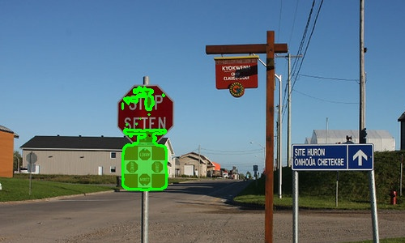
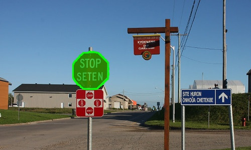
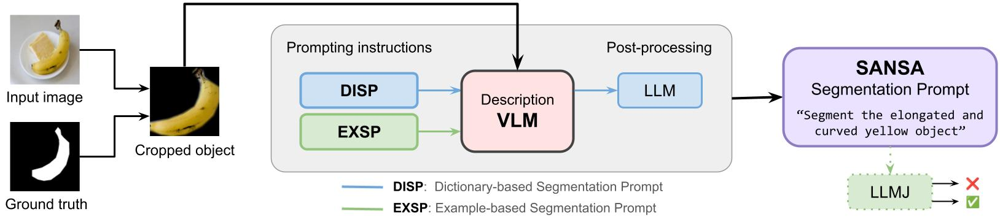
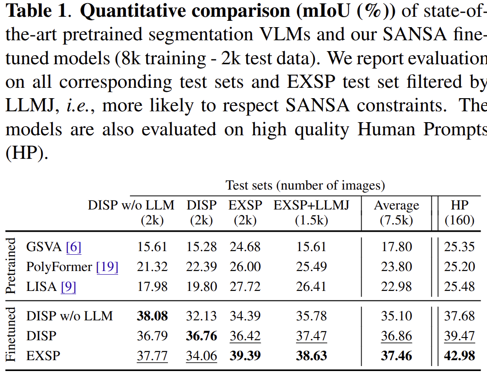
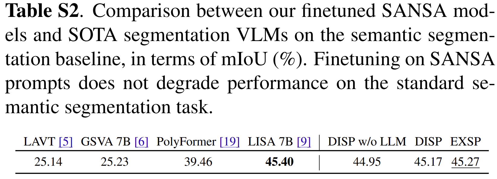

# Toward Semantic-Agnostic and Shape-Aware Vision-Language Segmentation Models

This repository contains the code for the paper Toward Semantic-Agnostic and Shape-Aware Vision-Language Segmentation Models (ICIP2026). [[arXiv](https://arxiv.org/abs/2605.28348)] [[IEEE Xplore]](https://ieeexplore.ieee.org/stamp/stamp.jsp?arnumber=11630351)

## News
- [] [**Coming soon**] Data are released (SANSA datasets, models weights).
- [] [2026.15.9] The first version of the code is released: SANSA data generation, fine-tuning and testing.
- [x] [2026.30.7] SANSA is selected as Oral Presentation in ICIP 2026!
- [x] [2026.30.4] [Paper](https://arxiv.org/pdf/2605.28348) is accepted to the IEEE International Conference on Image Processing 2026 (ICIP2026) !

## Introduction

### Motivation

<p align="center">
  
  
</p>

<p align="center"><strong>(a) LISA</strong>&emsp;&emsp;&emsp;&emsp;<strong>(b) SANSA (ours)</strong></p>

Vision-Language Models (VLMs) for the segmentation task rely on the usage of semantically annotated datasets such as COCO or LVIS, where masks correspond to high-level object classes, for both the training and the validation steps. VLMs indeed learn to align text with semantic categories, instead of reasoning about lower-level intrisic properties of the images, such as shape, color, texture or geometric structure.

In this paper, we introduce a new segmentation paradigm, **Semantic-Agnostic aNd Shape-Aware (SANSA)** segmentation, which aims to segment objects based on their appearance, including shape, color, texture, and spatial properties. This paradigm enables a flexible and generalizable form of segmentation that does not rely on predefined object categories, subcategories, or any other high-level semantic information.

### Method

<p align="center">  </p>

We propose two strategies using a description VLM for constructing prompts suitable for SANSA segmentation: **dictionary-based segmentation prompts (DISP)** and **example-based segmentation prompts (EXSP)**. We then finetune a state-of-the-art segmentation VLM (LISA) on our SANSA prompts. 

### Experimental Results

<p align="center">  </p>

<p align="center">  </p>

### Repository Installation

```bash
mkdir SANSA
cd SANSA
git clone git@github.com:CorentinSeutin/SANSA-ICIP-2026.git
```

### LISA Installation

Then, install [LISA](https://github.com/JIA-Lab-research/LISA) as follows: 

```bash
git clone git@github.com:JIA-Lab-research/LISA.git
```

The installation steps contained in **our** README should be enough. 

```bash
mv SANSA-ICIP-2026/scripts/sansa_dataset.py LISA/utils/ 
```

### Pretrained Weights

```bash
./download_weights.sh
```

This prepares InternVL2.5-8B, Mistral-7B-Instruct-v0.3, LISA-7B-v1 and CLIP using [Hugging Face's standard cache](https://huggingface.co/docs/huggingface_hub/guides/download#download-an-entire-repository), stored in `weights/hub/`. 

Training uses PyTorch AdamW through DeepSpeed (`torch_adam: true`) and disables ZeRO quantization, so it does not JIT-compile the `fused_adam` or `quantizer` extensions; a C++20 compiler is not needed at training startup.

SAM ViT-H is downloaded to `weights/sam_vit_h_4b8939.pth`. 

### Code & Data Preparation

#### Dependencies
```bash
python3.10 -m venv sansa-venv
```

```bash
source sansa-venv/bin/activate
```

```bash
pip install -r requirements.txt
```

```bash
python -m pip install \
  torch==2.3.1 \
  torchvision==0.18.1 \
  torchaudio==2.3.1 \
  --index-url https://download.pytorch.org/whl/cu118
```

#### Data

Download the [COCO](https://cocodataset.org/#home) segmentation dataset and organize it in the root as follows:

```bash
root
├── coco/
│   ├── annotations/
│   │   ├── instances_train2017.json
│   │   └── instances_val2017.json
│   └── images/
│       ├── train2017/
│       └── val2017/
```

#### SANSA Datasets Generation

```bash
./generate.sh
```

### Fine-Tuning LISA on SANSA Datasets

```bash
./train.sh
```

### Evaluating

Export the DeepSpeed checkpoints and merge their LoRA weights before running the evaluation:

```bash
./merge.sh
```

```bash
./evaluate.sh
```

## Scripts Reference

The shell scripts are the recommended entry points. The Python scripts called by each one are listed below; `scripts/weights/` is documented in the pretrained weights section and is omitted here.

### `download_weights.sh`

- `scripts/weights/download_weights.py` prepares all pretrained model files before an offline run.

### `generate.sh`

- `generate_cropped_objects.py` reads COCO annotations, extracts connected objects, saves cropped object images and records their polygons.
- `sample_objects.py` samples objects per category for the train/validation sets.
- `describe_objects.py` uses InternVL to generate shape, color, texture and appearance descriptions for DISP and EXSP.
- `generate_sansa_prompts.py` converts descriptions into segmentation prompts; it uses Mistral for the DISP reformulation step.
- `apply_LLMJ_filter.py` removes examples rejected by the LLM-as-a-judge step for `EXSP-LLMJ`.
- `split_objects.py` splits each generated prompt set into the training and validation portions.
- `prepare_data.py` copies the COCO images and writes the LISA annotation JSON files. It also prepares the HPD test set.

### `train.sh`

- `fine_tune.py` loads LISA, applies LoRA, trains on the generated SANSA datasets with DeepSpeed and writes checkpoints under `runs/`.

### `merge.sh`

- DeepSpeed's generated `zero_to_fp32.py` consolidates each distributed checkpoint.
- The consolidated checkpoint is merged with the local LISA model and saved under `runs/<dataset>/model/`.

### `evaluate.sh`

- `eval.py` loads the base or fine-tuned LISA model, evaluates it on each requested test dataset and writes gIoU/cIoU results under `eval_results/`.

### Supporting script

- `sansa_dataset.py` defines the dataset and collation utilities used by LISA during training and evaluation. It is copied into `LISA/utils/` during installation.
